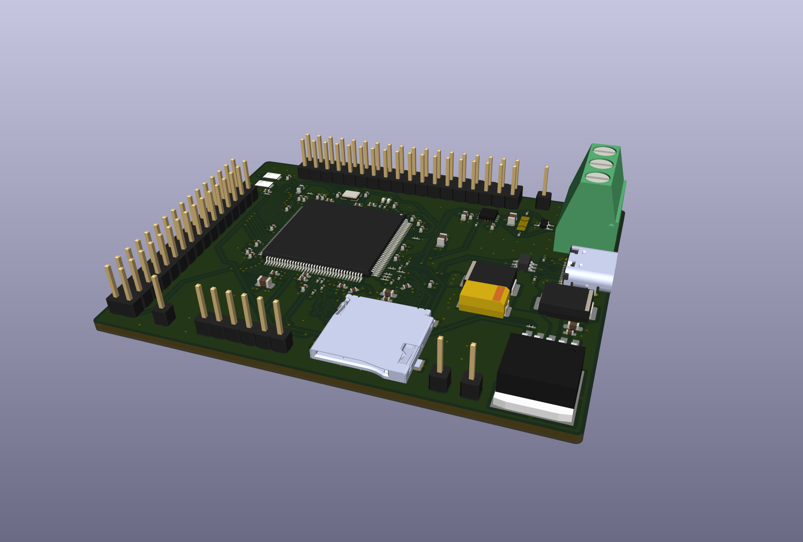
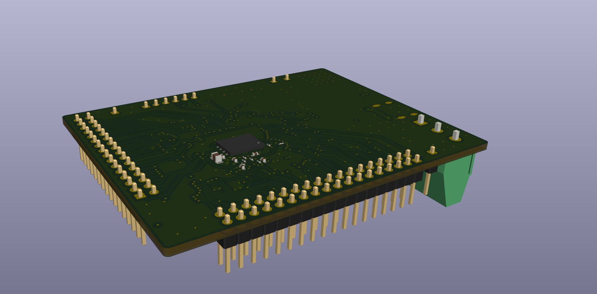
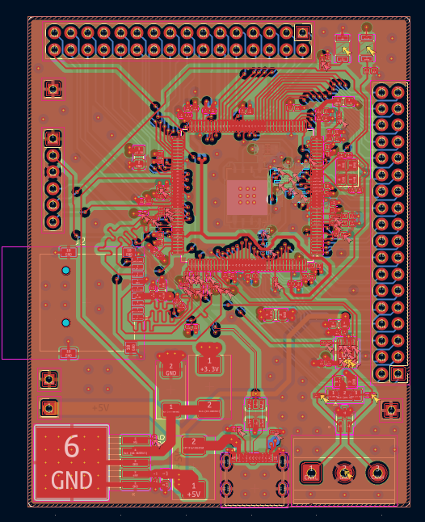
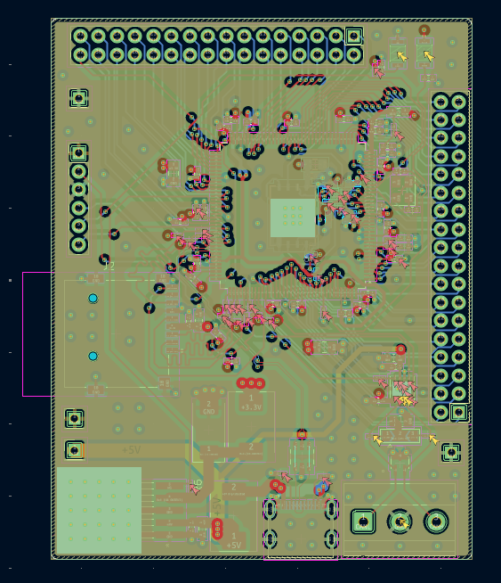
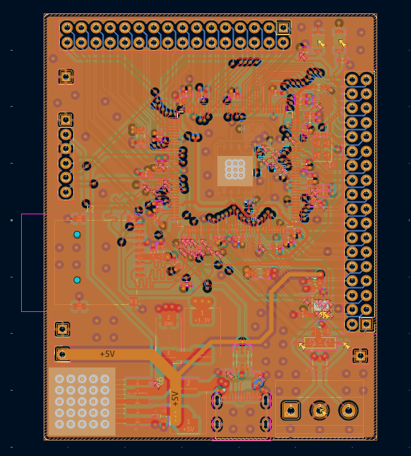
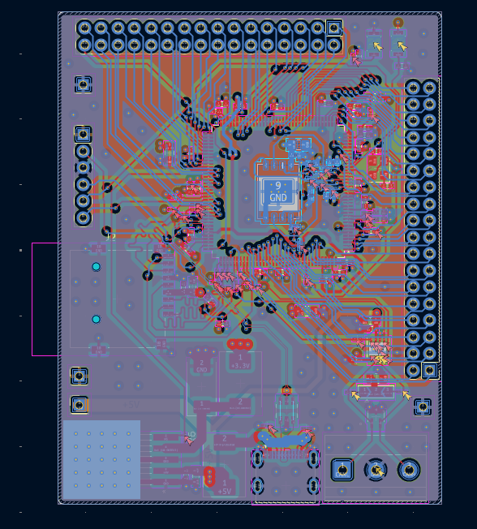

# STM32H755_Devboard
A custom devboard using the STM32H755 chip that I built to be used to prototype and test complex robotics machines I plan to build in the future and consists of MicroSD card slot, CAN-FD inbuilt, USB-C, SWD Debug header, boot and reset buttons to flash with USB-C, and external flash.

## Why did I make this?
I made this as I wanted a high-end microcontroller that has a dual core processor and has multiple functionalities, and that eventually led to me making this custom devboard that I plan on using to test prototypes for any complex robots I want to make and not worry about being bottlenecked by the microcontroller.

## Pictures

## Footprint Pictures
Top Layer

GND Layer

Power Layer

Bottom Layer

