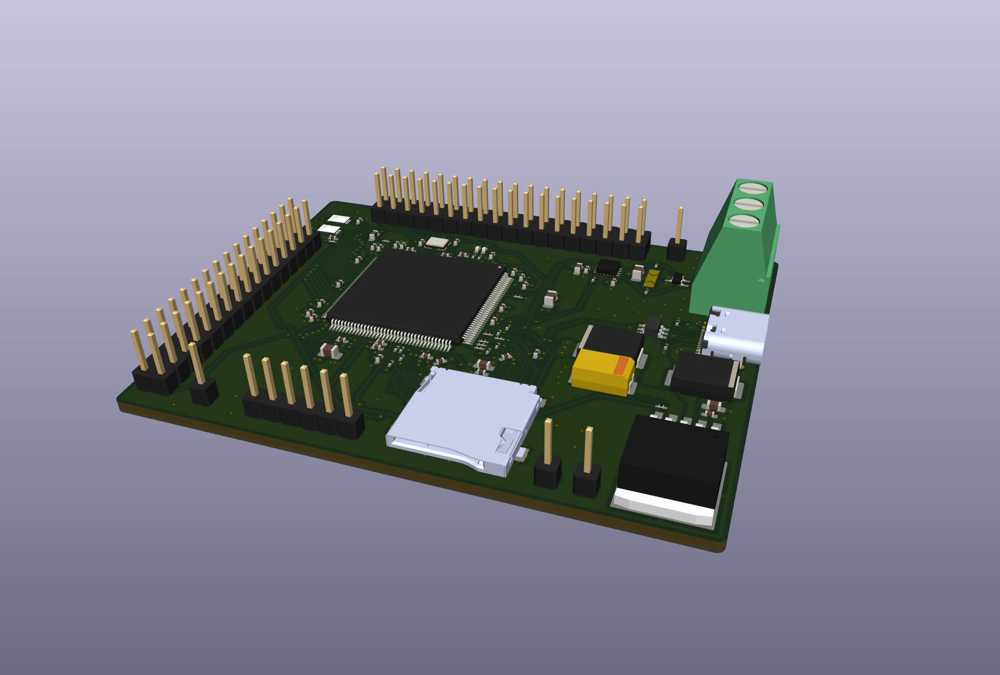
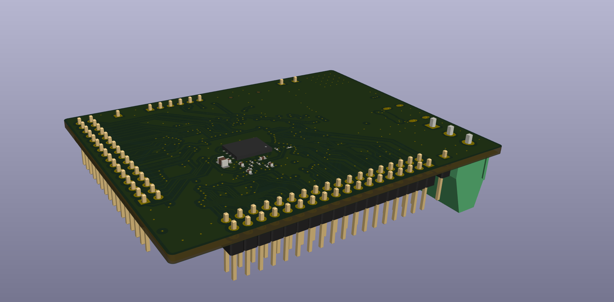
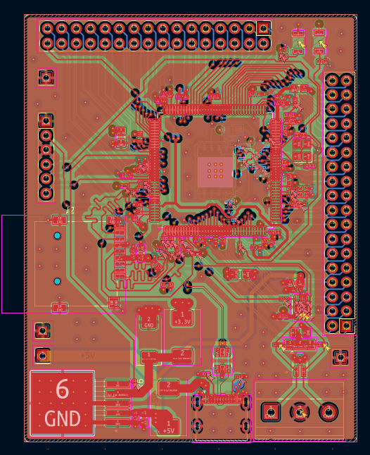
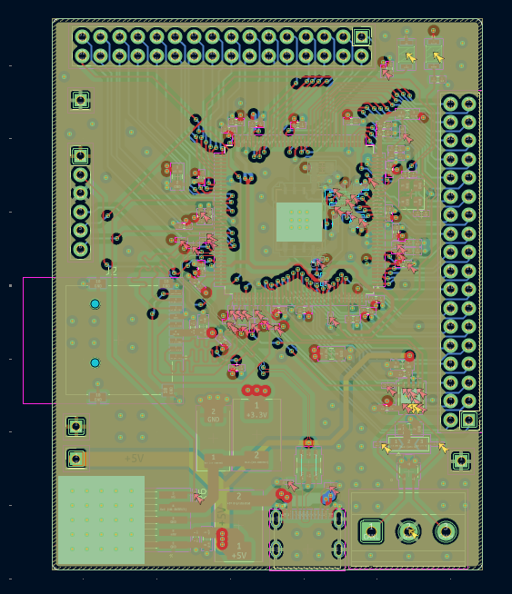
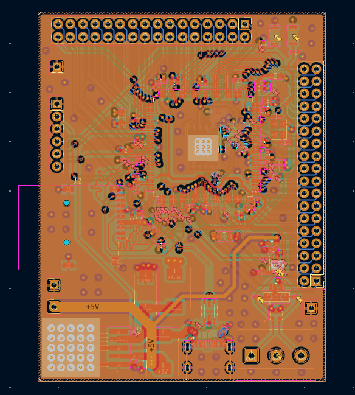
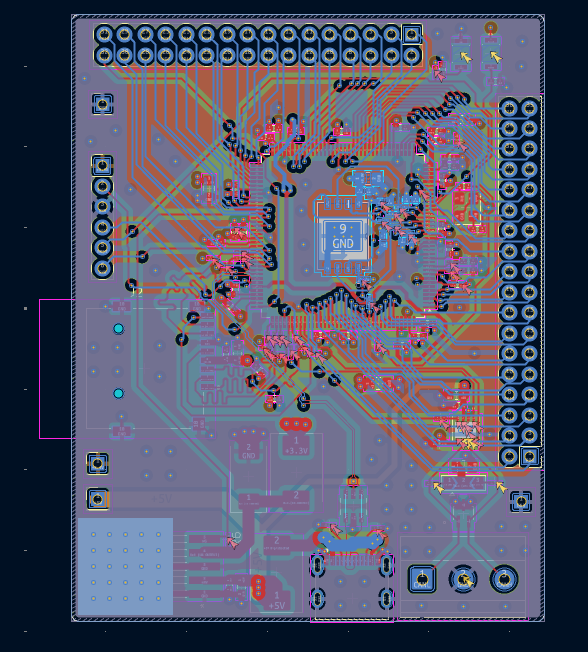

# STM32H755_Devboard
A custom devboard using the STM32H755 chip that I built to be used to prototype and test complex robotics machines I plan to build in the future and consists of MicroSD card slot, CAN-FD inbuilt, USB-C, SWD Debug header, boot and reset buttons to flash with USB-C, and external flash.

## Why did I make this?
I made this as I wanted a high-end microcontroller that has a dual core processor and has multiple functionalities, and that eventually led to me making this custom devboard that I plan on using to test prototypes for any complex robots I want to make and not worry about being bottlenecked by the microcontroller.

## Pictures

## Footprint Pictures
### Top Layer

### GND Layer

### Power Layer

### Bottom Layer

### BOM
| Component                 | Amount | Price per unit | Total Price | Purpose                                                                     | Link                                                                                                                                                                                                                                                                       |
|---------------------------|--------|----------------|-------------|-----------------------------------------------------------------------------|----------------------------------------------------------------------------------------------------------------------------------------------------------------------------------------------------------------------------------------------------------------------------|
| STM32H755ZIT3             | 1      | $20.11         | $20.11      | MCU for the board                                                           | https://www.digikey.com/en/products/detail/stmicroelectronics/STM32H755ZIT3/18086228                                                                                                                                                                                       |
| TYPE-C-16P-3MD            | 1      | $0.19          | $1.90       | USB-C data and power (Had to buy 10 as that was the minimum purchase amount | https://www.digikey.com/en/products/detail/shenzhen-shouhan-technology-co-ltd/type-c-16p-3md/29627623                                                                                                                                                                      |
| USBLC6-2SC6Y              | 1      | $0.67          | $0.67       | ESD protection for data lines                                               | https://www.digikey.com/en/products/detail/stmicroelectronics/usblc6-2sc6y/2819177                                                                                                                                                                                         |
| SSC54-E3/57T              | 2      | $1.05          | $2.10       | Diode to prevent reverse current                                            | https://www.digikey.com/en/products/detail/vishay-general-semiconductor-diodes-division/ssc54-e3-57t/1091564                                                                                                                                                               |
| TPS75733KTTR              | 1      | $11.26         | $11.26      | 3.3V LDO                                                                    | https://www.digikey.com/en/products/detail/texas-instruments/tps75733kttr/1673150                                                                                                                                                                                          |
| TCAN1044VDRBRQ1           | 1      | $1.86          | $1.86       | CAN-FD Transceiver                                                          | https://www.digikey.com/en/products/detail/texas-instruments/tcan1044vdrbrq1/13245687                                                                                                                                                                                      |
| ESD2CAN24DCKRQ1           | 1      | $0.40          | $0.40       | ESD protection for CAN-FD                                                   | https://www.digikey.com/en/products/detail/texas-instruments/esd2can24dckrq1/16982070                                                                                                                                                                                      |
| TSX-3225_25.0000MF20X-AJ0 | 1      | $0.37          | $0.37       | 25MHz crystal                                                               | https://www.digikey.com/en/products/detail/epson/TSX-3225-25-0000MF20X-AJ0/5168442?s=N4IgTCBcDaICoGUAaBaAzGMBWA%2BtgdAAzGECyAYmIagIIBShIAugL5A                                                                                                                             |
| W25Q256JVEIQ TR           | 1      | $6.08          | $6.08       | External Flash                                                              | https://www.digikey.com/en/products/detail/winbond-electronics/w25q256jveiq-tr/5803969                                                                                                                                                                                     |
| MSD-1-A                   | 1      | $0.38          | $0.38       | MicroSD card port                                                           | https://www.digikey.com/en/products/detail/same-sky-formerly-cui-devices/msd-1-a/21799641                                                                                                                                                                                  |
| EVP-AWBD4A                | 2      | $0.30          | $0.60       | Button for boot and reset                                                   | https://www.digikey.com/en/products/detail/panasonic-industry/EVP-AWBD4A/8568273                                                                                                                                                                                           |
| GRM155Z71A225KE44D        | 2      | $0.15          | $0.30       | VCAP Capacitors with under .1 Ohm ESR                                       | https://www.digikey.com/en/products/detail/murata-electronics/GRM155Z71A225KE44D/10264880                                                                                                                                                                                  |
| C2012X7R1A475K085AC       | 4      | $0.27          | $1.08       | Buk and filtering capacitor                                                 | https://www.digikey.com/en/products/detail/tdk/C2012X7R1A475K085AC/3951763                                                                                                                                                                                                 |
| GRT188R61C106KE13D        | 3      | $0.29          | $0.87       | Bulk Capacitor                                                              | https://www.digikey.com/en/products/detail/murata-electronics/GRT188R61C106KE13D/5416739                                                                                                                                                                                   |
| KAM05CR71A105KH           | 4      | $0.17          | $0.68       | Decoupling/Filtering capacitor                                              | https://www.digikey.com/en/products/detail/kyocera-avx/KAM05CR71A105KH/22198421                                                                                                                                                                                            |
| CC0402JRX7R8BB104         | 31     | $0.05          | $1.58       | Decoupling capacitor                                                        | https://www.digikey.com/en/products/detail/yageo/CC0402JRX7R8BB104/11491448                                                                                                                                                                                                |
| C0402C100F4HACAUTO        | 2      | $0.18          | $0.36       | Crystal load capacitor                                                      | https://www.digikey.com/en/products/detail/kemet/C0402C100F4HACAUTO/7955039                                                                                                                                                                                                |
| T495D476K025ATE250        | 1      | $2.36          | $2.36       | LDO output bulk capacitor                                                   | https://www.digikey.com/en/products/detail/kemet/T495D476K025ATE250/3760574                                                                                                                                                                                                |
| BLM18SG121TN1D            | 1      | $0.14          | $0.14       | Ferrite bead for analog filtering                                           | https://www.digikey.com/en/products/detail/murata-electronics/blm18sg121tn1d/1016155                                                                                                                                                                                       |
| RC0201JR-070RL            | 1      | $0.10          | $0.10       | Resistor Jumper for VREF+                                                   | https://www.digikey.com/en/products/detail/yageo/RC0201JR-070RL/1948898                                                                                                                                                                                                    |
| RC0201FR-0710KL           | 10     | $0.03          | $0.34       | 10K ohm Pull-up resistor                                                    | https://www.digikey.com/en/products/detail/yageo/RC0201FR-0710KL/1948870                                                                                                                                                                                                   |
| RC0201FR-0733RL           | 2      | $0.10          | $0.20       | 33 Ohm dampening resistor                                                   | https://www.digikey.com/en/products/detail/yageo/RC0201FR-0733RL/1948893                                                                                                                                                                                                   |
| RC0201FR-0722RL           | 12     | $0.03          | $0.41       | 22 Ohm dampening resistor                                                   | https://www.digikey.com/en/products/detail/yageo/RC0201FR-0722RL/5280378                                                                                                                                                                                                   |
| RC0201FR-07330RL          | 2      | $0.10          | $0.20       | 330 Ohm current limiting resistor                                           | https://www.digikey.com/en/products/detail/yageo/RC0201FR-07330RL/5280464                                                                                                                                                                                                  |
| RC0201FR-135K1L           | 2      | $0.10          | $0.20       | USB-C detection pull-down resistor                                          | https://www.digikey.com/en/products/detail/yageo/RC0201FR-135K1L/17017100                                                                                                                                                                                                  |
| RC0201FR-0760R4L          | 2      | $0.10          | $0.20       | CAN-FD Termination resistors                                                | https://www.digikey.com/en/products/detail/yageo/RC0201FR-0760R4L/5280609                                                                                                                                                                                                  |
| XZMDK68W-2                | 1      | $0.23          | $0.23       | Debug LED                                                                   | https://www.digikey.com/en/products/detail/sunled/XZMDK68W-2/4745956                                                                                                                                                                                                       |
| XZVG68W-2                 | 1      | $0.26          | $0.26       | Debug LED                                                                   | https://www.digikey.com/en/products/detail/sunled/XZVG68W-2/4745975                                                                                                                                                                                                        |
| M50-3530242               | 39     | $0.08          | $3.28       | Headers                                                                     | https://www.digikey.com/en/products/detail/harwin-inc/M50-3530242/7044013                                                                                                                                                                                                  |
| 1729131                   | 1      | $1.44          | $1.44       | CAN-FD Terminal Block                                                       | https://www.digikey.com/en/products/detail/phoenix-contact/1729131/260616?gclsrc=aw.ds&gad_source=1&gad_campaignid=20470400566&gbraid=0AAAAADrbLlj-SwBWNmRjWltE4mZiVSUbP&gclid=CjwKCAjwyOzSBhBTEiwAmxvJ-i2JYjfEpwLhNZfRW2nS4iQSrP2ChCn7KzhPh37FH3seILU0pkDq6RoCWAIQAvD_BwE |
|PCB                        |1       | $15.32        | $76.60       |                                                                            ||
| Total                     |        |                | $130.36     |                                                                             |                                                                                                                                                                                                                                                                            |
